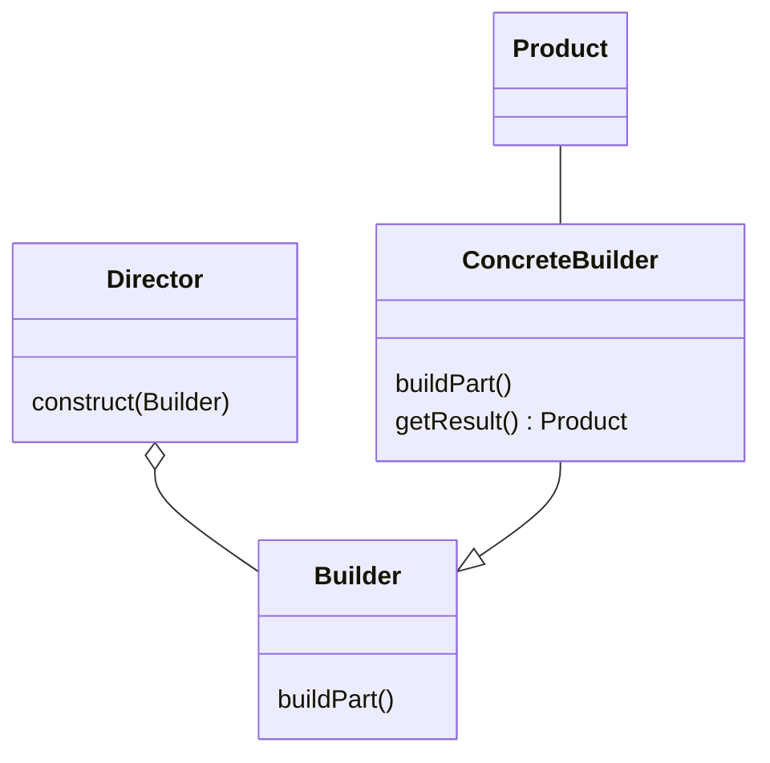
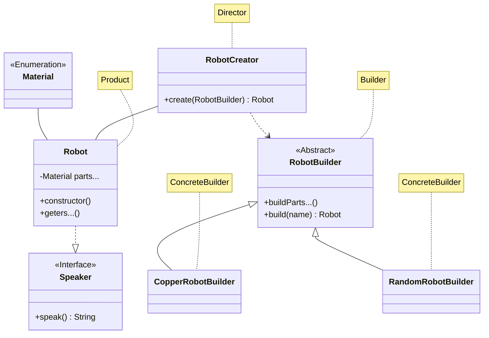

# Padrão Builder

O padrão Builder tem a intenção de separar a construção de um objeto complexo de
sua representação possibilitando também que o processo de construção crie 
diferentes representações.

* O algoritmo para a criação desse objeto complexo deve ser independente das
partes que o compõem e de como elas são montadas.
* O processo de construção deve permitir diferentes representações para o objeto 
que é construído.

## Estrutura geral do padrão



* **Builder**: Uma interface ou classe abstrata para criação das partes de um 
objeto.  
* **ConcreteBuilder**: Constrói e monta as partes do produto pela implementação 
do `Builder`. Também fornece uma interface 
para recuperação do produto a ser montado.  
* **Director**: Constrói um objeto usando a interface do `Builder`.  
* **Product**: Representa o objeto complexo em construção. O `ConcreteBuilder` 
constrói a representação interna do produto e 
define o processo pelo qual ele é montado.

## Estrutura do código de exemplo



* **Robot** (como `Product`) é o objeto complexo a ser montado.  
* **RobotBuilder** (como `Builder`) é a interface (nesse caso uma classe 
abstrata) que especifica as etapas de montagem.
* **CopperRobotBuilder** e **RandomRobotBuilder** (como `ConcreteBuilder`) são 
classes que implementam a especificação 
de montagem.
* **RobotCreator** (como `Director`) constrói um novo objeto aplicando as etapas 
corretas de montagem de um construtor.

## Utilização

Para que o objeto complexo possa ser montado deve-se instanciar o 
`ConcreteBuilder` e utilizá-lo juntamente ao `Director`:  
```java

// Esse aqui é o nosso 'ConcreteBuilder'
RobotBuilder builder = new CopperRobotBuilder();

// RobotCreator é o nosso 'Director' que para essa implementação
// disponibiliza a montagem/construção através do método estático
// .create()
RobotCreator.create(builder, "Robot Name");

// Para criar um novo objeto é preciso chamar o método
// .create() do Director que executará a montagem e retornará
// o novo objeto montado.
Robot myRobot = RobotCreator.create(builder, "My Robot");

// A partir daqui o objeto já está pronto para uso.
myRobot.printInfos();

```
## Compilação e Execução

Para compilar e executar o código de exemplo disponível 
[Builder](../../BuilderPattern.java), navegue até a pasta raiz do projeto 
através de seu terminal e execute o comando:

```bash
javac BuilderPattern.java && java BuilderPattern
``` 
O arquivo será compilado e executado em seguida e o retorno será algo como:

```
Name: My Copper Robot
 --| head: COPPER
 --| left arm: COPPER, right arm: COPPER
 --| left hand: COPPER, right hand: COPPER
 --| chest: COPPER
 --| left leg: COPPER, right leg: COPPER
 --| left foot: COPPER, right foot: COPPER
 --| speaking: "Bahh duuu tii"

-------------

Name: My Random Robot
 --| head: COPPER
 --| left arm: COPPER, right arm: TITANIUM
 --| left hand: SILVER, right hand: CARBON
 --| chest: STEEL
 --| left leg: BRONZE, right leg: BRONZE
 --| left foot: BRASS, right foot: BRONZE
 --| speaking: "Ghuji Lipqw 42!"

 ```